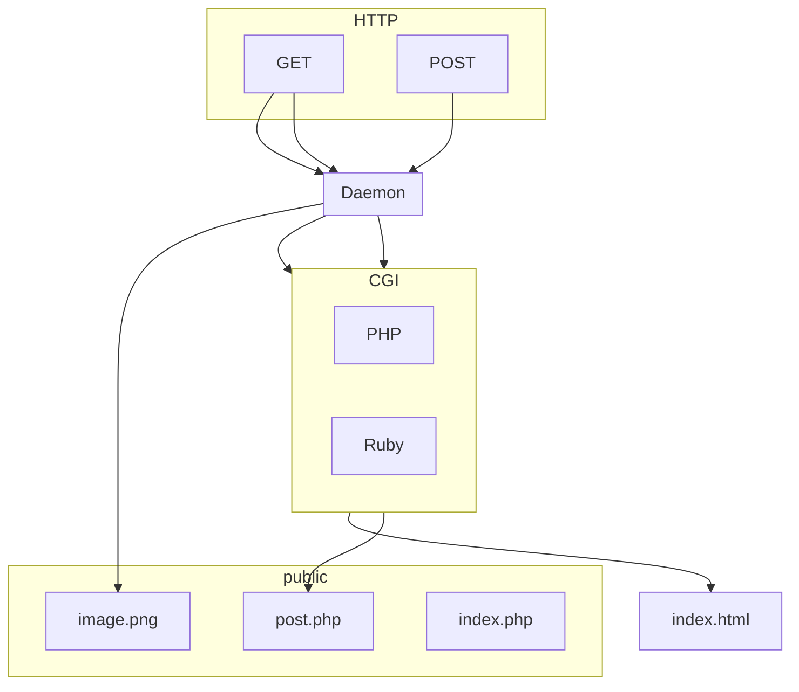

## Apache 2.0 / Nginx

Самый популярный сервер и модель построения веб-сайтов



Т.е. __все ссылки - реальные пути в папке `public`__
Файлы со стандартными расширениями просто напрямую сериализуются и отправляются клиенту, а файлы `*.php`, `*.rb` буду запрошенными отправляются сначала на CGI, где их обрабатывает шаблонизатор, а затем уже сериализуется и отправляется клиенту.

Базовые методы демона
- GET
- POST

## Как выглядит старт
Вся конфигурация apache / nginx лежит где-то в жопе линуксового диска в файле `sites.conf`, где лежат записи вида

```
http {
  include    conf/mime.types;
  index    index.html index.htm index.php;

  server { 
    listen       80;
    server_name  domain1.com www.domain1.com;
    access_log   logs/domain1.access.log  main;
    root    /var/www/public;

	# статические файлы лежат в public
	location ~ ^/(html|images|javascript|js|css|flash|media|static)/  {
      expires 30d;
    }

	# все что запрошено с расширением php отправляется на PHP сервер
    location ~ \.php$ {
      fastcgi_pass   127.0.0.1:1025;
    }
  }
```

затем создаем страницу в папке `public`

```html
<body>
	<h1>Привет мир! <?php now() ?></h1>
</body>
```

и запускаем его демона и готово. На порту 80 будет уже доступна страница.


### Примеры запросов

### Get

```
GET /books/index.php?book=78366
```

подразумевает, что есть папка
```
- public
- - books
- - - index.php
```

где в файле содержится (более менее реальный псевдокод)

```php
<?php
	require_once 'connect.php'; //файл подключения к БД
	require_once 'header.php'; //хедер
?>

<div class="w3-panel">
    <p>This is a simple book page for my PHP development skills.</p>
</div>

<?php
	// забираем данные из БД используя параметр GET
	$sql = "SELECT COUNT(*) FROM posts blah blah " $_GET['boook'];

    $result = mysqli_query($dbcon, $sql);

    while ($row = mysqli_fetch_assoc($result)) {

      $id = htmlentities($row['id']);
      $title = htmlentities($row['title']);
      $des = htmlentities(strip_tags($row['description']));
      $slug = htmlentities($row['slug']);
      $time = htmlentities($row['date']);

      $permalink = "p/".$id ."/".$slug;

      echo '<div class="w3-panel w3-sand w3-card-4">';
      echo "<h3><a href='$permalink'>$title</a></h3><p>";

      echo substr($des, 0, 100);

      echo '<div class="w3-text-teal">';
      echo "<a href='$permalink'>Read more...</a></p>";

      echo '</div>';
      echo "<div class='w3-text-grey'> $time </div>";
      echo '</div>';
   }


  echo "<p><div class='w3-bar w3-center'>";
  echo "</div></p>";


  include("categories.php");
  include("footer.php");

?>
```

### POST
Для поста нужна страница, которая его сделает. Напишем сначала ее

#### мелкая формочка
```html
<form action="/target.php" method="POST" enctype="application/x-www-form-urlencoded">
    <input type="text" name="username" value="sidthesloth"/>
    <input type="text" name="password" value="slothsecret"/>
    <input type="submit" value="Submit" />
</form>
```
при нажатии кнопки Submit, отправится запрос вида

```
POST /target.php?username=xxxx&password=yyyy
```

Что по сути эквивалентно запросу GET с параметрами в ссылке. Тогда где-то в файле `target.php`

```php
<?php
	$var = $_POST["username"];
	//там пишем в БД или что-то другое делаем
	//обязательный редирект на страницу (типа ура успех, записалось)
	header('Location: '.$newURL);
?>

Этого текста никто не увидит, так как будет сразу редирект
```

PS: Сейчас в угоду JS, почти никто так не делает напрямую. Обычно это JS на фоне при нажатии на кнопку Submit вручную копирует данные в свой пакет и отправляет его втихую фоном в виде того же POST запроса. Таким образом можно избежать полного обновления страницы.

#### большая такая формочка с файлами может

Это скорее типичный случай использования форм
```html
<form action="/target.php" method="POST" enctype="application/x-www-form-urlencoded">
    <input type="text" name="username" value="sidthesloth"/>
    <input type="text" name="password" value="slothsecret"/>
    <input type="submit" value="Submit" />
</form>
```

что превратится

```
POST /target.php
хереды...
---border name=username type=plain/text
Игорь
---border name=password type=plain/text
табуретки
```

между этими барьерами может быть все, что угодно, в том числе бинарные данные в виде кракозябр

Однако обработка данных не измениться

```php
$__POST["username"]
```

---

Это минимальный набор для работы Amazon (2009), Хабр (2012), Wordpress (2023) и т.д.

__Разумеется почти любой проект на PHP пользуется компонентным подходом__ собирая страницы из кусочков переиспользуемых `.php` файлов.


## ExpressJS / Derby / NextJS / React
Совсем иная парадигма при приготовлении сайтов. Сам сервер работает на той же среде, что и шаблонизатор или CGI. Привязка к файловой системе необязательна. Это ближе к нашей реализации на WL

Поведение всего сервера может настраиваться в принципе в одном файле

```js
const express = require('express')
const app = express()
const port = 3000

app.get('/', (req, res) => {
  //в res можно указать также и заголовки для ответа
  res.send('Hello World!')
})

app.listen(port, () => {
  console.log(`Example app listening on port ${port}`)
})
```

чтобы пробросить пути к статическим файлам используется

```js
app.use(express.static('public'));
```

или даже так, добавляя пути поиска в других папках

```js
app.use(express.static('public'));
app.use(express.static('others'));
app.use(express.static('C://'));
```


## Как выглядит старт
Папка проекта

```
- server.js
- package.json
```

затем в shell

```
npm install
node server.js
```

сервер открывается на порту указанном в коде. Т.е. вся конфигурация лежит вместе с проектом. Либо берется из параметров запуска


### Шаблонизатор?
Здесь оказывается большой выбор. Я приведу несколько из-них

### Усы (Mustaage)
Обычно компонент страницы это папка с двумя файлами

```
- index.js
- index.html
```

где `html` не совсем просто HTML, а

```html title="index.html"
<div style="list-{{#styles.theme}}">
	<!-- так можно циклы, почти как в PHP -->
	{{foreach #list as #i}}
		<div style="item">{{#i.data}}</div>
	{{end}}
</div>

<!-- так можно импортировать другие блоки и передавать данные им -->
{{#component_name data=localData}}
```

а в файле с логикой

```js title="index.js"
const list = [];

//аргументы могут передаваться как явно, так и неявно
this.oncreate((arguments) => {
	//достаем данные из БД
	list.push(...);
});

const styles = {
	theme: 'dark'
}
```

То, как передавать данные запроса GET, POST в эти компоненты - забота пользователя или фреймворка. 

### JSX
Идея решить проблему разделения шаблона и кода и делать это в привычном виде, как будто пишем HTML

Любая страница или компонент - это всегда функция

```jsx
const name = 'Josh Perez';
const Element = <h1>Hello, {name}</h1>;

export const myPage = () => {
	return (<div>
				<Element/>
			</div>);
}
```

Может показаться, что мы пишем на HTML, однако это просто мимикрия. Почти любой HTML код будет невалидным JSX - это его большой минус.

Можно заметить, что WLX вдохновлен JSX. Кстати многие недостатки JSX были переработаны и не наследуются.


---

Таким образом, текущая комбинация HTTPHandler & WebSocketHandler + WSP / WLX уже позволяет реализовать любое веб-приложение.


