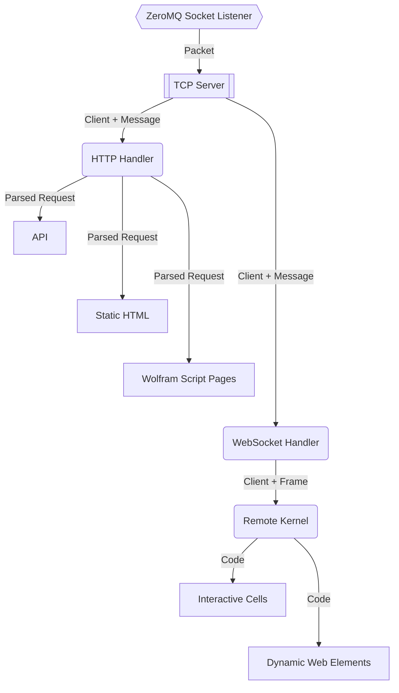
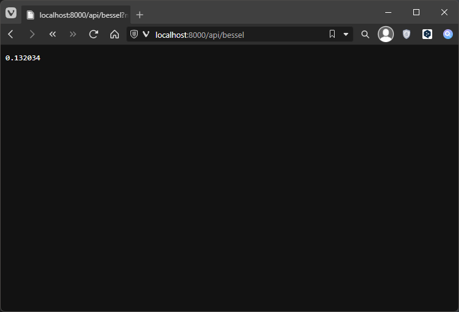
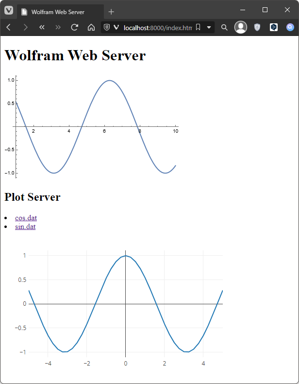
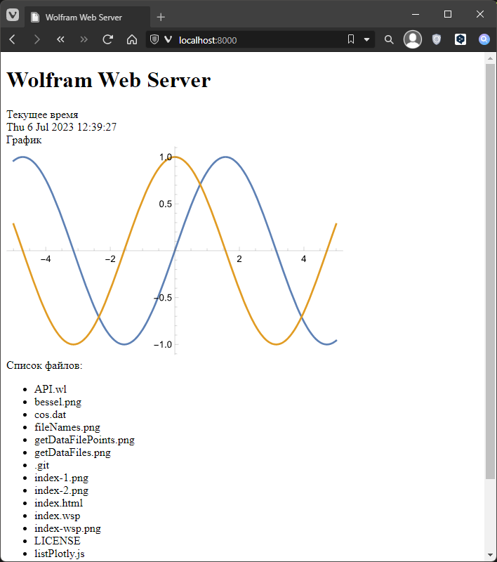

# Wolfram Web Server

## TLDR

Запускаем файл _WebServer.wls_ либо двойным щелчком либо из терминала:

```bash
wolframscript -f WebServer.wls
```

Затем открываем браузер по адресу <http://localhost:8000>.

## Schema

Наша цель - веб-сервер, полностью написанный на Wolfram Language.
Низкоуровневая часть сервера работает на основе встроенных функций:

* [`SocketListen`](https://reference.wolfram.com/language/ref/SocketListen.html) -
запускает асинхронную задачу прослушивающую указанный порт или сокет
* [`SocketListener`](https://reference.wolfram.com/language/ref/SocketListener.html) -
объект "слушателя"
* [`SocketObject`](https://reference.wolfram.com/language/ref/SocketObject.html) -
объект представляющий сам сокет

С их помощью мы можем создать объект, который представляет собой сервер.
Этот объект сможет прослушивать пакеты приходящие по сети и отправлять ответы.
Эти встроенные функции используют библиотеку ZeroMQ.
С их помощью мы сможем реализовать сначала сервер работающий по протоколу TCP,
а затем поверх этого сервера мы реализует другие верхнеуровневые протоколы.
Примерная схема работы сервера представлена ниже:



В этом руководстве начав сверху и двигаясь вниз по блокам из схемы
мы реализуем свой веб-сервер, который будет использовать возможности
браузера, а так же всю мощь языка Wolfram.

## TCP Server

Начиная с этого раздела весь код мы будем писать в файле _Tutorial.wls_.
Кроме того для запуска в интерактивном режиме можно использовать блокнот _Tutorial.nb_.

**Определения:**

---

* Сервер - объект `TCPServer`, который задан в качестве обработчика в `SocketListener`
* Клиент - объект `SocketObject`, т.е. входящее соединение для сервера
* Пакет - ассоциация, которая представляет собой TCP-пакет пришедший по сети
* Сообщение - цельные данные одного или множества сетевых пакетов
* Обработчик - функция, которая применяется к полученному пакету или сообщению

---

Первое, что мы сделаем - это создадим и сразу же запустим сервер,
который работает по протоколу TCP. Сделать это довольно просто.
Сначала устанавливаем необходимые пакеты:

```mathematica
PacletInstall["KirillBelov/Internal"]
PacletInstall["KirillBelov/Objets"]
PacletInstall["KirillBelov/TCPServer"]
```

Теперь импортируем определения из этих пакетов:

```mathematica
Get["KirillBelov`Internal`"]
Get["KirillBelov`Objects`"]
Get["KirillBelov`TCPServer`"]
```

Создаем сам сервер:

```mathematica
tcp = TCPServer[]
```

И запускаем его:

```mathematica
listener = SocketListen[8000, tcp@#&]
```

Все готово. Но что дальше? Сервер ведь абсолютно пустой и ничего не делает.
Нужно придумать для него функциональность. Допустим, первое, что мы добавим -
это ответ на `ping`. Т.е. если в сервер приходит сообщение с строкой `ping`,
то обратно клиенту он высылает `pong`. Для этого нам нужно указать серверу
обработчик _завершенности_ пакетов и сам обработчик сообщений:

```mathematica
tcp["CompleteHandler", "Ping"] = pingQ -> pingLength
tcp["MessageHandler", "Ping"] = pingQ -> pong
```

Что значат строки выше? Всякий раз, когда сервер будет получать пакет,
то он будет сначала применять функцию `pingQ`.
Если это дейтствительно `ping`, то далее вычисляется ожидаемая длина сообщения при помощи
функции `pingLength`. Зачем это сделано? Дело в том, что по протоколо TCP из сети будут
приходить пакеты размером не более 8 кб. В случае коротких сообщений один пакет будет
содержать одно сообщение целиком и тогда вычисление длины не понадобится,
но если мы попытаемся выслать на сервер большой файл, то он будет разбит на
множество пакетов длиной по 8 кб. И когда к нам придет первый пакет мы должны
точно определить какого развера этот файл. Иначе после мы уже не сможем быть уверенны,
что файл пришел целиком. Именно для этого нужен обрабочик завершенности,
который проверяет длину сообщения.
После того, как входящее сообщение было завершено запускатся обработка
сообщения при помощи функции `pong`. Т.е. мы добавили в наш сервер 3 функции,
но пока что ни одну не определили. Давайте сделаем это! Основное внимание на аргументы -
все три функции должны принимать на вход два аргумента. Первый аргумент - это сокет, т.е.
по сути подключенный к серверу клиент, куда мы будем отправлять ответ. А второй аргмент - это
массив байт, в котором хранится пришедшее сообщение. Сначала проверка, что это `ping`:

```mathematica
pingQ[client_SocketObject, message_ByteArray] :=
(*Return:True|False*)
Echo[ByteArrayToString[message] == "ping", "pingQ"]
```

Теперь вычисление длины сообщения - функция должна возвращать целое число:

```mathematica
pingLength[client_SocketObject, message_ByteArray] :=
(*Return:_Integer*)
Echo[Length[message], "pingLength"]
```

И последнее - функция, которая обрабатывает сообщение и возвращает результат в виде
массива байт, который сервер автоматически отправит клиенту:

```mathematica
pong[cleint_SocketObject, message_ByteArray] := (
    Echo[message, "ping"];
    (*Return:ByteArray[]*)
    Echo[StringToByteArray["pong"], "pong"]
)
```

Теперь точно все готово! Подключимся к нашему серверу и отправим в него первое сообщение:

```mathematica
socket = SocketConnect[8000]
BinaryWrite[socket, StringToByteArray["ping"]]
result = SocketReadMessage[socket]
ByteArrayToString[result]
Close[socket]
```

В итоге после выполнения последнего блока кода в консоль (или в окно _Messages_)
напечатается следующее:

>```log
>>> pingQ True
>>> pingLength 4
>>> pingQ True
>>> ping ByteArray[<4>]
>>> pong ByteArray[<4>]
>```

Это будет значит, что сервер работает. Его минимальная функциональность готова.
Теперь не останавливая сервер мы можем продолжить наполнять его функциональностью.
Чтобы это сделать на уровне TCP нам достаточно добавить новые обработчики
по аналогии с обработчиками сообщения `ping`.

Чтобы этот обработчик не мешал нам в дальнейшем, очистим все обработчики сервера вот так:

```mathematica
tcp["CompleteHandler"] = <||>
tcp["MessageHandler"] = <||>
```

## HTTP Handler

---

* Запрос - сообщение формате HTTPRequest, пробразованное в ассоциацию
* Ответ - ответ клиенту в формате HTTPResponse - массив байт или строка
* Обработчик - здесь это функция, которая обрабатывает запросы

---

Теперь давайте добавим серверу возможность работать по протоколу HTTP.
Для этого необходимо установить еще один пакет:

```mathematica
PacletInstall["KirillBelov/HTTPHandler"]
```

И импортируем его:

```mathematica
Get["KirillBelov`HTTPHandler`"]
Get["KirillBelov`HTTPHandler`Extensions`"]
```

Чтобы добавить возможность обрабатывать запросы по HTTP,
мы должны сначала создать объект обработчика при помощи функции из пакеты:

```mathematica
http = HTTPHandler[]
```

И добавим этот обработчик в работающий TCP-сервер вот так:

```mathematica
AddHTTPHandler[tcp, http]
```

Теперь нужно наделить функционильностью сам обработчик HTTP-сообщений,
т.к. по умолчанию он ничего не умеет и будет просто закрывать все входящие соединения.
Для этого у обработчика есть свойство `"MessageHandler"`. Добавить новый обработчик
уже внутрь HTTP мы можем в том же стиле, в котором добавляли новые обработчики
сообщений в TCP-сервер. Например вот так мы можем добавить серверу возможность
при запросе файла отвечать этим самым файлом:

```mathematica
http["MessageHandler", "GETFile"] = 
    GetFileRequestQ[{"html", "js", "css", "svg", "png", "jpg"}] -> ImportFileAsText
```

* `"GETFile"` - просто уникальный ключ в списке обработчиков
* `GetFileRequestQ` - проверяет, что запрос использует метод `GET` и запрашивает файл
* `GetFileAsText` - импортирует файл и отправляет его клиенту

Теперь давайте создадим в рабочией директории простую html-страницу _index.html_,
в которой будет вот такая разметка:

```html
<!DOCTYPE html>
<html>
    <head>
        <meta charset="utf-8">
        <title>Wolfram Web Server</title>
    </head>
    <body>
        <h1>Wolfram Web Server</h1>
    </body>
</html>
```

И откроем браузер по адресу [http://localhostL:8000/index.html](http://localhost:8000/index.html).


На скрншоте выше как раз изображен браузер с открытой страницей.
Это означает, что запросы к веб-страницам или картинкам вполне работают.
В дальнейшем мы сильно изменим разметку файла index.html,
но не будем концентрировать на этом внимание, кроме самых важных деталей.
Вместо этого мы сосредоточимся на том, чтобы подробно разобрать функциональность
самого сервера.

Все функции, которые мы добавляем в обработчик принимают на вход один аргумент,
который представляет собой ассоциацию с разобраным сообщением - т.е. запрос.
Ассоциация содержит внутри себя следующие ключи:

* `"Method"` - метод HTTP запроса. Например, `GET`, `POST`, `PUT`, ...
* `"Path"` - адрес запроса. Например, `/pages/about.html`
* `"Query"` - URL параметры запроса `/page?name=Ivan&Age=25` в виде ассоциации
* `"Headers"` - заголовки HTTP-запроса - `content-type: application/json`
* `"Body"` - тело запроса

Чтобы понять, как с этим запросом работать - создадим еще один обработчик.
Добавим серверу возможность строить график в формате SVG.
Сначала функция, которая проверяет, что это запрос на построение графика.
Функция должна принимать на вход запрос и возвращать логическое значение:

```mathematica
plotQ[request_Association] := And[
    request["Method"] == "GET", 
    request["Path"] == "/plot", 
    SubsetQ[{"func", "from", "to"}, Keys[request["Query"]]]
]
```

Следующая функция, которая принимает на вход этот же запрос и возвращает строку.
Кроме того можно возвращать ассоциацию, которая должна содержать в себе ключи
`"Code"`, `"Message"`, `"Headers"` и `"Body"`.

```mathematica
plot[request_Association] := Module[{func, from, to, graphics}, 
    With[{
        func = ToExpression[request["Query", "func"]], 
        from = ToExpression[request["Query", "from"]], 
        to = ToExpression[request["Query", "to"]]
    }, 
        graphics = Plot[func[x], {x, from, to}]; 
    ]; 

    (*Return: _String*)
    ExportString[graphics, "SVG"]
]
```

Теперь добавим этот функционал в `HTTPHandler`:

```mathematica
http["MessageHandler", "Plot"] = plotQ -> plot
```

Перейдем в браузере по адресу <http://localhost:8000/plot?func=Sin&from=1&to=10>:

![Plot[Sin[x], {x, 1, 10}]](plot(sin).png)

Все работает (по крайней мере у меня). Теперь мы понимаем последовательность действий,
коорые нужно выполнить, чтобы добавить новые возможности серверу для работы с HTTP.
Еще раз напомню, что все это время мы не останавливали ранее TCP запущенный сервер,
а проделали все изменения "на ходу".

## API

### API Funcs

Для упровещения создания API можно использовать несколько заранее
созданных функций. Одна из них - это `AssocMatchQ`. Ниже пример использования:

```mathematica
AssocMatchQ[<|"Method" -> "GET"|>][<|"Method" -> "GET", "Query" -> <||>|>] (* => True *)
```

Эта функция сравнивает ассоциацию с шаблоном. В правых частях правил можно использовать
`StringExpression` вот так:

```mathematica
AssocMatchQ[<|"Path" -> __ ~~ ".html"|>][<|"Path" -> "/page.html"|>] (* => True *)
```

Еще стоит использовать встроенную функцию `APIFunction`.
Например, реализовать вызов построения графика можно вот так (теперь PNG, а не SVG):

```mathematica
plot[request_Association] := 
APIFunction[
    {"func" -> "String", "from" -> "Number", "to" -> "Number"}, 
    ExportString[Plot[Evaluate[ToExpression[#func]][x], {x, #from, #to}], "PNG"]&
][request["Query"]]
```

Мы можем так же встроить эту реализацию на веб-страницу. Добавим элемент в _index.html_:

```html

```

И снова откроем [index.html](http://localhost:8000/index.html):


В итоге, мы можем создать небольшую функцию-обертку.
Сначала как обычно проверка:

```mathematica
apiQ = AssocMatchQ[<|"Path" -> "/api/" ~~ __|>]
```

Затем сама небольшая вспомогательная функция,
которая извлекает из параметров запроса типы аргументов (пока только) строку и число:

```mathematica
argType[arg_String] := 
Which[
    StringMatchQ[arg, NumberString], "Number", 
    True, "String"
]
```

И сама функция:

```mathematica
api[request_Association] := 
Module[{format, result}, 
    format = If[KeyExistsQ[request["Query"], "format"], request["Query", "format"], "String"]; 
    With[{
        func = ToExpression[StringSplit[request["Path"], "/"][[-1]]], 
        args = Normal[Map[argType, Delete[request["Query"], "format"]]]
    }, 
        result = If[Length[args] > 0, 
            APIFunction[args, func][request["Query"]], 
            func[]
        ]; 

        (*Return: _String*)
        ExportString[result, format]
    ]
]
```

Добавим серверу этот API:

```mathematica
http["MessageHandler", "API"] = apiQ -> api
```

И теперь для добавления новой функции мы можем создать короткое определение.
Например, функция, которая вычисляет функцияю Бесселя порядка `n` от переменной `z`:

```mathematica
bessel = Function[BesselJ[#n, N[#z]]]
```

Открыв браузер по адресу <http://localhost:8000/api/bessel?n=4&z=3.5>,
мы увидим следующее:



Все работает. Можно определить и другие функции таким образом.
Напрмер функция, которая возвращает список файлов в рабочей директории в формате JSON.
Так стоп... подождите, ведь нам даже не нужно ее определять.
Можно просто перейти по адресу <http://localhost:8000/api/FileNames?format=JSON>:


И вот мы получили список файлов в рабочей директории в текущий момент.

### Plot Server

Таким же образом мы можем сделать специальную API-функцию, которая будет читать файл с диска
и возвращать даные в виде JSON-массива, который сразу же будет строится как график.
Определимяся с API который мы хотим реализовать.

* getDataFiles - список файлов с данными для построения
* getPoints - собственно точки для построения

Просто список всех файлов с расширением _.dat_:

```mathematica
getDataFiles = Function[
    FileNames["*.dat"]
]
```

Сами точки из указанного файла в параметре `file`:

```mathematica
getDataFilePoints = Function[
    Import[#file, "Table"]
]
```

Для проверки создадим вот такой файл в рабочей директории:

```mathematica
Export["sin.dat", Table[{x, Sin[x]}, {x, -5, 5, 0.25}], "Table"]
Export["sin.dat", Table[{x, Cos[x]}, {x, -5, 5, 0.25}], "Table"]
```

И откроем браузер по адресу <http://localhost:8000/api/getDataFiles?format=JSON>:


А затем можно открыть и сам файл _sin.dat_,
перейдя по адресу <http://localhost:8000/api/getDataFilePoints?file=sin.dat&format=JSON>:


Осталось добавить все это на страницу. Добавим в заголовок страницы вот такую ссылку:

```html
<head>
    <!-- ... -->
    <script src="https://cdn.plot.ly/plotly-2.24.1.min.js" charset="utf-8"></script>
</head>
```

Затем в самый низ элемента body вставим список файлов, элемент для графика и скрипт для построения:

```html
<body>
    <!-- ... -->
    <h2>Plot Server</h2>
    <ui id="data-files">

    </ui>
    <div id="list-plotly"></div>
    <script src="listPlotly.js"></script>
</body>
```

Ну и создадим сам скрипт _listPlotly.js_ в той же директории.
Скрипта мы получаем массив файлов и добавляем на страницу в виде списка:

```js
let dataFilesUl = document.getElementById("data-files")

let dataFiles = getDataFiles();

for (const file of dataFiles) {
    let li = document.createElement("li"); 
    li.innerHTML = "<a href=\"#" + file + "\">" + file + "</a>";
    li.onclick = () => listPlotly(file);
    dataFilesUl.appendChild(li);
}
```

Стоит сразу отметить, что в момент добавления элемента в список,
ему сразу же устанавливается событие по клику, которое будет выполнять функцию `listPlotly`.
Чтобы это работало нужно определить еще несколько функций `getDataFiles` и `getDataFilePoints`:

```js
function httpGet(theUrl)
{
    var xmlHttp = new XMLHttpRequest();
    xmlHttp.open( "GET", theUrl, false ); 
    xmlHttp.send( null );
    return xmlHttp.responseText;
}

function currentEndpoint(){
    let protocol = window.location.protocol;
    let host = window.location.host;
    let endpoint = protocol + '//' + host;
    return endpoint;
}

function getDataFiles(){
    return JSON.parse(httpGet(currentEndpoint() + "/api/getDataFiles?format=JSON"));
}

function getDataFilePoints(file){
    return JSON.parse(httpGet(currentEndpoint() + "/api/getDataFilePoints?file=" + file + "&format=JSON"));
}
```

А также функцию для построения графика,
которую мы возьмем из библиотеки [Plotly](https://plotly.com/javascript/getting-started/):

```js
function listPlotly(file){
    let listPlotlyDiv = document.getElementById("list-plotly"); 
    let data = getDataFilePoints(file); 
    let layout = {
        autosize: false,
        width: 500,
        height: 300,
        margin: {
          l: 50,
          r: 50,
          b: 40,
          t: 40,
          pad: 4
        }
      };

    Plotly.newPlot(listPlotlyDiv, [data], layout);
}
```

Теперь обновим страницу и нажмем на _"cos.dat"_:



Все работает. Благодаря JavaScript мы можем выбирать доступные файлы на диске
и смотреть их содержимое в виде графика. Благодаря использованию HTTP-клиента
в JS мы можем обновлять график без перезагрузки страницы.

## Wolfram Script Pages

Wolfram Script Pages - мощный подход к созданию HTML страниц используя
язык Wolfram напрямую в разметке страницы. Данный подход чем-то похож
на Java Server Pages (которые используются в WebMathematica) или на PHP.
В этом разделе мы будут базовые примеры использования WSP на стороне сервера.

### Как работает WSP

Все очень просто - WSP расширяет синтаксис разметки HTML, добавляя новый тег:

```html
<div>
    <?wsp DateString[] ?>
</div>
```

Добавив такой тег в страницу сервер на Wolfram Language заменит тег на текущую дату.
Это произойдет на **стороне сервера**. Т.е. эту разметку нельзя увидеть в браузере.
Чаще всего такая разметка хранится в файлах с расширением _.wsp_.
А во время запроса к этому файлу сервер преобразует всю разметку в валидный HTML.
Но одиночный тег - это не единственный способ вставить выражение на WL в разметку.
Выражения можно делить и перемешивать в другими тегами и текстом.
Вот так например можно создать список:

```html
<ul>
    <?wsp Table[?>
        <li><?wsp file ?></li>
    <?wsp {file, getDataFiles[]}]?>
</ul>
```

Кроме того графики по умолчанию обрабатываются и превращаются в SVG:

```html
<?wsp Plot[Evaluate[Table[BesselJ[i, x], {i, 0, 4}]], {x, 0, 5}]] ?>
```

В общем такой подход позволяет воплотить в жизнь любые свои фантазии по
скрещиванию HTML и WL. Больше узнать про WSP можно в репозитоии Кирилла Васина:
<https://github.com/JerryI/wl-wsp>.

### Как использовать

Для начала нужно установить пакет из Paclet Repositoy:

```mathematica
PacletInstall["JerryI/WSP"]
```

И импортировать определения:

```mathematica
Get["JerryI`WSP`"]
Get["KirillBelov`HTTPHandler`WSPAdapter`"]
```

Теперь добавим в HTTP обработчик саму возможность обрабатывать WSP:

```mathematica
http["MessageHandler", "WSP"] = GetFileRequestQ[{"wsp"}] -> HypertextProcess
```

А так же сделаем страницей по умолчанию _index.wsp_:

```mathematica
http["MessageHandler", "Index"] = 
    AssocMatchQ[<|"Path" -> "/"|>] -> Function[HypertextProcess[#, "index.wsp"]]
```

И создадим страницу _inedx.wsp_:

```html
<!DOCTYPE html>
<html>
    <head>
        <meta charset="utf-8">
        <title>Wolfram Web Server</title>
    </head>
    <body>
        <h1>Wolfram Web Server</h1>
        Текущее время<br/>
        <?wsp DateString[] ?><br/>
        График<br/>
        <?wsp Plot[{Sin[x], Cos[x]}, {x, -5, 5}] ?><br/>
        Список файлов: <br/>
        <ul>
            <?wsp Table[?>
                <li><?wsp file ?></li>
            <?wsp , {file, FileNames[]}] ?>
        </ul>
    </body>
</html>
```

И перейдем на страницу по умолчанию <http://localhost:8000>



## WebSocket

Подключение по протоколу WS

## Markdown

Испортируем MD файлы как веб страницы.
