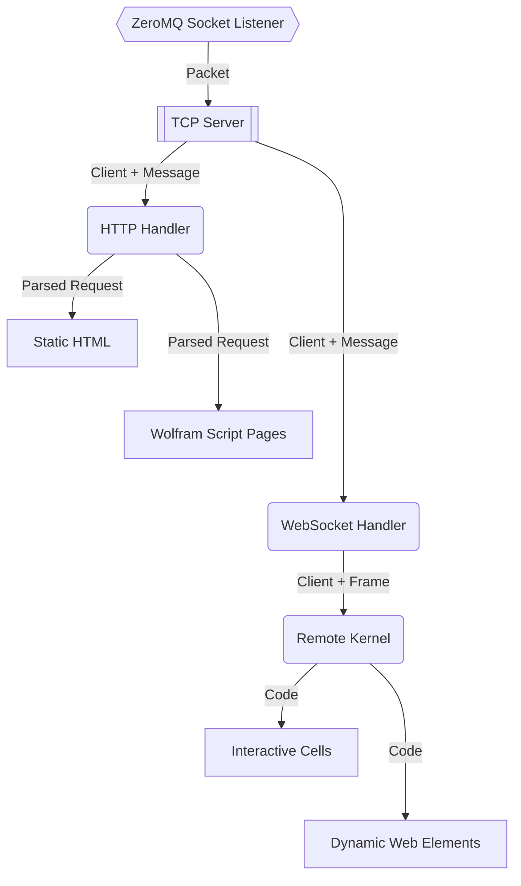
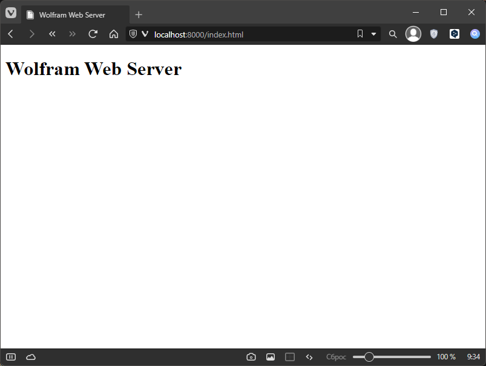

# Wolfram Web Server

## TLDR

Запускаем файл _WolframWebServer.wls_ либо двойным щелчком либо из консоли командой:

```bash
wolframscript -f WolframWebServer.wls
```

Затем открываем браузер по адресу <http://localhost:8000>.

## Schema

Наша цель - веб-сервер, полностью написанный на Wolfram Language.
Низкоуровневая часть сервера работает на основе встроенных функций:

* [`SocketListen`](https://reference.wolfram.com/language/ref/SocketListen.html) -
запускает асинхронную задачу прослушивающую указанный порт или сокет
* [`SocketListener`](https://reference.wolfram.com/language/ref/SocketListener.html) -
объект "слушателя". Его можно остановить или удалить. Кроме того в нем содержится информация.
* [`SocketObject`](https://reference.wolfram.com/language/ref/SocketObject.html) -
Объект представляющий сам сокет

С их помощью мы можем создать объект, который представляет собой сервер.
Этот объект сможет прослушивать пакеты приходящие по сети и отправлять ответы.
Эти встроенные функции используют библиотеку ZeroMQ.
С их помощью мы сможем реализовать сначала сервер работающий по протоколу TCP,
а затем поверх этого сервера мы реализует другие верхнеуровневые протоколы.
Примерная схема работы сервера представлена ниже:



[click](#http-handler)

## TCP Server

Первое, что мы сделаем - это создадим и сразу же запустим сервер,
который работает по протоколу TCP. Сделать это довольно просто.
Сначала устанавливаем необходимые пакеты:

```mathematica
PacletInstall["KirillBelov/Internal"]
PacletInstall["KirillBelov/Objets"]
PacletInstall["KirillBelov/TCPServer"]
```

Теперь импортируем определения из этих пакетов:

```mathematica
Get["KirillBelov`Internal`"]
Get["KirillBelov`Objects`"]
Get["KirillBelov`TCPServer`"]
```

Создаем сам сервер:

```mathematica
tcp = TCPServer[]
```

И запускаем его:

```mathematica
listener = SocketListen[8000, tcp@#&]
```

Все готово. Но что дальше? Сервер ведь абсолютно пустой и ничео не делает.
Нужно придумать для него функциональность. Допустим, первое, что мы сделаем - это 
ответ на `ping`. Т.е. если в сервер приходит строка `ping`, то обратно он высылает `pong`.
Для этого нам нужно добавить в сервер обработчик завершенности сообщений:

```mathematica
tcp["CompleteHandler", "Ping"] = pingQ -> pingLength
tcp["MessageHandler", "Ping"] = pingQ -> pong
```

Что значат строки выше? Всякий раз, когда сервер будет получать входящее сообщение,
то он будет сначала применять функцию `pingQ`, чтобы убедиться, что запрос пришел именно за этим.
Если это дейтствительно `ping`, то далее вычисляется ожидаемая длина этого сообщения при помощи
функции `pingLength`. После того как входящее сообщение было завершено запускатся обработка
сообщения при помощи функции `pong`. Т.е. мы добавили в наш сервер 3 функции,
но пока что ни одну не определили. Давайте сделаем это! Основное внимание на аргументы -
все три функции должны принимать на вход два аргумента. Первый аргумент - это сокет, т.е.
по сути подключенный к серверу клиент, куда мы будем отправлять ответ. А второй аргмент - это
массив байт, в котором хранится пришедшее сообщение. Сначала проверка, что это `ping`:

```mathematica
pingQ[client_SocketObject, message_ByteArray] :=
(*Return:True|False*)
Echo[ByteArrayToString[message] == "ping", "pingQ"]
```

Теперь вычисление длины сообщения - функция должна возвращать целое число:

```mathematica
pingLength[client_SocketObject, message_ByteArray] :=
(*Return:_Integer*)
Echo[Length[message], "pingLength"]
```

И последнее - функция, которая обрабатывает сообщение и возвращает результат в виде
массива байт, который сервер автоматически отправит клиенту:

```mathematica
pong[cleint_SocketObject, message_ByteArray] := (
    Echo[message, "ping"];
    (*Return:ByteArray[]*)
    Echo[StringToByteArray["pong"], "pong"]
)
```

Теперь точно все готово! Подключимся к нашему серверу и отправим в него первое сообщение:

```mathematica
socket = SocketConnect[8000]
BinaryWrite[socket, StringToByteArray["ping"]]
result = SocketReadMessage[socket]
ByteArrayToString[result]
Close[socket]
```

В итоге после выполнения последнего блока кода в консоль (или в окно *Messages*)
напечатается следующее:

>```log
>>> pingQ True
>>> pingLength 4
>>> pingQ True
>>> ping ByteArray[<4>]
>>> pong ByteArray[<4>]
>```

Это будет значит, что сервер работает. Его самая минимальная функциональность готова.
Теперь не останавливая сервис мы можем продолжить наполнять его функциональность.
Чтобы это сделать на уровне TCP нам достаточно добавить новые обработчики
по аналогии с обработчиками сообщения `ping`.

Чтобы этот обработчик не мешал нам, очистим все обработчики:

```mathematica
tcp["CompleteHandler"] = <||>
tcp["MessageHandler"] = <||>
```

## HTTP Handler

Теперь давайте добавим серверу возможность работать по протоколу HTTP.
Для этого необходимо установить еще один пакет:

```mathematica
PacletInstall["KirillBelov/HTTPHandler"]
```

И импортируем:

```mathematica
Get["KirillBelov`HTTPHandler`"]
Get["KirillBelov`HTTPHandler`Extensions`"]
```

Теперь чтобы добавить возможность обрабатыать запросы по HTTP мы должны сначала
создать объект обработчика при помощи функции из пакеты:

```mathematica
http = HTTPHandler[]
```

И добавим этот обработчик в работающий TCP-сервер вот так:

```mathematica
tcp["CompleteHandler", "HTTP"] = HTTPPacketQ -> HTTPPacketLength
tcp["MessageHandler", "HTTP"] = HTTPPacketQ -> http
```

Готово. Теперь нужно наделить функционильностью сам обработчик HTTP-сообщений,
т.к. по умолчанию он ничего не умеет и будет просто закрыать все входящие запросы.
Для этого у обработчика есть свойство `"MessageHandler"`. Добавиь новый обработчик
уже внутр HTTP мы можем в том же стиле, в котором добавляли новые обработчики
сообщений в TCP-сервер. Например вот так мы можем добавить серверу возможность
при запросе файла отвечать этим самым файлом:

```mathematica
http["MessageHandler", "GETFile"] = 
    GetFileRequestQ[{"html", "js", "css", "svg", "png", "jpg"}] -> GetFileAsText
```

* `"GETFile"` - просто уникальный ключ в списке обработчиков.
Он не несет в себе никакой функциональноти.
* `GetFileRequestQ` - это функция, которая проверяет, что полученный запрос по HTTP
использует метод `GET` и обращается к файлу на диске с указаннами расширениями.
* `GetFileAsText` - импортирует файл с диска в виде строки, оборачивает его в HTTP-ответ
и отправляет файл клиенту, который сделал этот запрос.

Теперь давайте создадим в рабочией директории простую html-страницу _index.html_,
в которой будет вот такая разметка:

```html
<!DOCTYPE html>
<html>
    <head>
        <meta charset="utf-8">
        <title>Wolfram Web Server</title>
    </head>
    <body>
        <h1>Wolfram Web Server</h1>
    </body>
</html>
```

И откроем браузер по адресу [http://localhostL:8000/index.html](http://localhost:8000/index.html).



Все вышеперечисленные функции принимают на вход один аргумент.
Чтобы понять, что это за аргумент давайте добавим еще один обработчик,
но не из заранее определенных. Создадим его сами.
Добавим серверу возможность строить график в формате SVG.
Сначала функция, которая проверяет, что это запрос на построение графика:

```mathematica
plotQ[request_Association] := And[
    request["Method"] == "GET", 
    request["Path"] == "/plot"
]
```

Функция должна принимать на вход ассоциацию, а возвращать логическое значение.
Ассоциация содержит внутри себя разобранный запрос:

* `"Method"` - метод HTTP запроса. Например, `GET`, `POST`, `PUT`, ...
* `"Path"` - адрес запроса. Например, `/pages/about.html`
* `"Query"` - URL параметры запроса - `/page?name=Ivan&Age=25`
* `"Headers"` - заголовки HTTP-запроса - `content-type: application/json`
* `"Body"` - тело запроса

Следующая функция, которая принимает на вход эту же ассоциацию и возвращает или строку или ассоциацию.

```mathematica
plot[request_Association] := Module[{func, from, to, graphics}, 
    func = ToExpression[request["Query", "func"]]; 
    from = ToExpression[request["Query", "from"]]; 
    to = ToExpression[request["Query", "to"]]; 

    graphics = Plot[func[x], {x, from, to}]; 

    (*Return: _String*)
    ExportString[graphics, "SVG"]
]
```

Теперь добавим этот функционал в обработчик:

```mathematica
http["MessageHandler", "Plot"] = plotQ -> plot
```

Перейдем в браузере по адресу <http://localhost:8000/plot?func=Sin&from=1&to=10>:

![Plot[Sin[x], {x, 1, 10}]](plot(sin).png)

## API

Для упровещения создания API можно использовать несколько заранее
созданных функций. Одна из них - это `AssocMatchQ`. Ниже пример использования:

```mathematica
AssocMatchQ[<|"Method" -> "GET"|>][<|"Method" -> "GET", "Query" -> <||>] (* => True *)
```

Эта функция сравнивает ассоциацию с шаблоном. В правых частях правил можно использовать
`StringExpression` вот так:

```mathematica
AssocMatchQ[<|"Path" -> "/" ~~ __ ~~ ".html"|>][<|"Method" -> "GET", "Path" -> "/page.html"] (* => True *)
```

Еще стоит использовать встроенную функцию `APIFunction`.
Например, реализовать вызов построения графика можно вот так:

```mathematica
plot[request_Association] := 
APIFunction[
    {"func" -> "String", "from" -> "Number", "to" -> "Number"}, 
    ExportString[Plot[Evaluate[ToExpression[#func]][x], {x, #from, #to}], "PNG"]&
][request["Query"]]
```

Мы можем так же встроить эту реализацию на веб-страницу. Добавим элемент в *index.html*:

```html

```

И снова откроем [index.html](http://localhost:8000/index.html):


В итоге, мы можем создать небольшую функцию-обертку вот так:

```mathematica
apiQ := AssocMatchQ[<|"Path" -> "/api/" ~~ __|>]

argType[arg_String] := 
Which[
    StringMatchQ[arg, NumberString], "Number", 
    True, "String"
]

apiFunс[request_Association] := 
Module[{format}, 
    format = If[KeyExistsQ[request["Query"], "format"], request["Query", "format"], "String"]; 
    With[{
        func = ToExpresion[StringSplit[request["Path"], "/"][[-1]]], 
        args = Normal[Map[argType, Delete[request["Query"], "format"]]]
    }, 
        ExportString[APIFunction[args, func][request["Query"]], format]
    ]
]
```

Добавим серверу этот API:

```mathematica
http["MessageHandler", "API"] = apiQ -> apiFunc
```

И теперь для добавления новой функции мы можем создать короткое определение.
Например, функция, которая вычисляет функцияю Бесселя порядка `n` от переменной `z`:

```mathematica
besselAPI = Function[BesselJ[#n, N[#z]]]
```

## Plot Server

Таким же образом мы можем сделать специальную API-функцию, которая будет читать файл с диска
и возвращать даные в виде JSON-массива, который сразу же будет строится как график.
Определимяся с API который мы хотим реализовать.

* getDataFiles - список файлов с данными для построения
* getPoints - собственно точки для построения

```mathematica
getDataFiles = Function[
    
]
```

## Wolfram Script Pages

Использование WL в разметке страниц

## WebSocket

Подключение по протоколу WS

## Markdown

Испортируем MD файлы как веб страницы.

## 